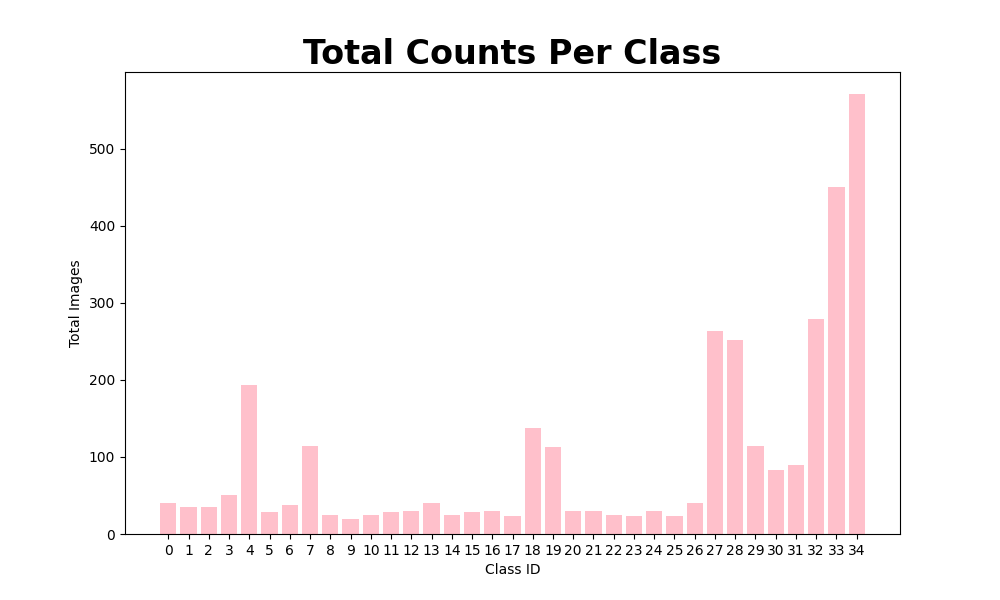
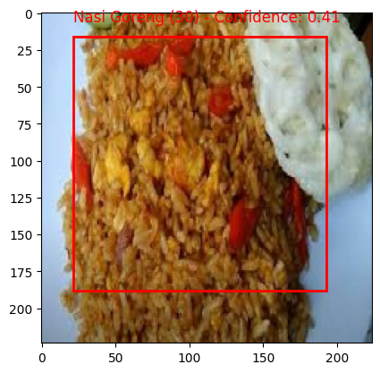
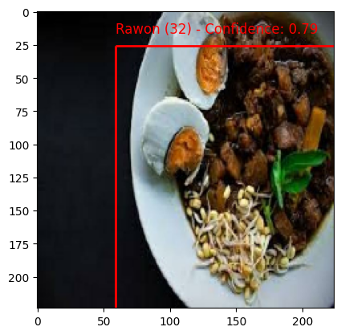

# Machine Learning Path

StuntFree utilizing Tensorflow to develop Food Image Recognition model, VertexAI and LangChain to detect Food Nutrient, and LogisticRegression to predict Stunting Probabilities

 

## Dataset

### Image Dataset
We used collecting image and class data from Kaggle and Roboflow. 

| Food Class       | Bread | Bubur | Cheese | Daging Cincang | Gambar agar agar | Kentang | Olahan Ikan | Susu | Telur | Wortel | Yogurt |            
|------------------|-------|-------|--------|-----------------|-------------------|---------|--------------|------|-------|--------|--------|
| Quantity         | 192   | 168   | 136    | 192             | 180               | 194     | 193          | 184  | 190   | 76     | 198    |

  

### Nutrition Dataset
We used to collecting nutrient dataset from scrapping and generating sintetic data through AI.

Nutrient Dataset Classess :

| Calories | Carbohydrates | Fat | Protein | Calcium | Iron | Vitamin A | Vitamin D | Zinc |
|----------|----------------|-----|---------|---------|------|------------|-----------|-------|

### Stunting Dataset
We used to colecting stunting dataset from Kaggle

Stunting Dataset Features:

| Gender | Age | Birth Weight | Birth Length | Body Weight | Body Length | Breastfeeding | Stunting | is_sanitized_place | is_healthy_food |
|--------|-----|--------------|--------------|-------------|-------------|----------------|----------|--------------------|-----------------|

 
 

# Model

## Food Image Recognition Model

| Model          | Accuracy | F1    |          
| -------------- | -------- | ----- |
| MobileNetV2    | 0.907    | 0.907 |
| InceptionV3       | 0.863    | 0.863 |
| ResNet50   | 0.195    | 0.235 |

    
    

## Food Nutrient Prediction Model

| Model          | Accuracy | F1    |          
| -------------- | -------- | ----- |
| MobileNetV2    | 0.907    | 0.907 |
| InceptionV3       | 0.863    | 0.863 |
| ResNet50   | 0.195    | 0.235 |

## Stunting Prediction Model

| Model          | Accuracy | F1    |          
| -------------- | -------- | ----- |
| MobileNetV2    | 0.907    | 0.907 |
| InceptionV3       | 0.863    | 0.863 |
| ResNet50   | 0.195    | 0.235 |